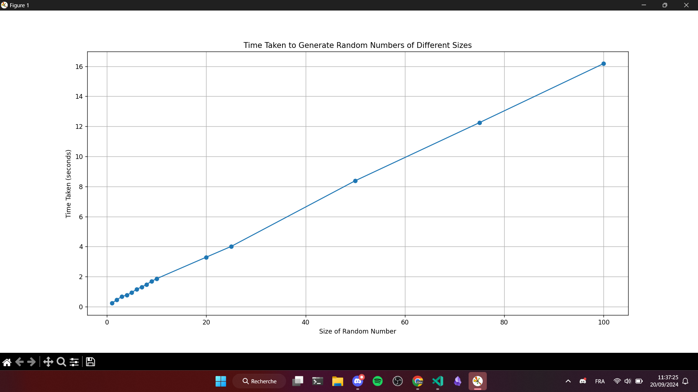
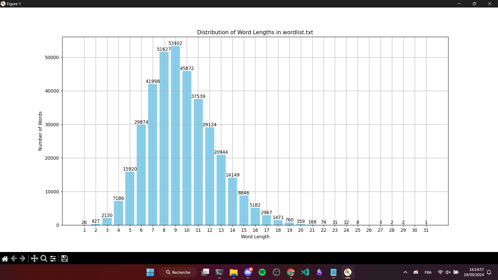

# random_algorithm
A very simple yet original random algo made while overthinking about randomness  
  

`random_algorithm` is a Python library that generates random numbers using a novel approach based on English words and the current epoch time. It utilizes ASCII values of shuffled words, reduces them to single digits, and combines these digits to generate a random number of a specified size. This implementation attempts to get as close as possible to true randomness by using time-based factors and word shuffling.

## Features

- Generates random numbers based on shuffled English words.
- ASCII values of each word are reduced to single digits.
- Supports dynamic generation of random numbers of any specified size.
- Includes special logic to generate lower numbers (like `0` or `1`), which can sometimes be difficult to produce with traditional randomization methods.
- Provides functions to extract seeds based on time and to reduce any number to a single digit.

## Usage

Install the package in your repo

```bash
pip install random_algorithm
```

**If you use a requirements file, add this line to it :**

```bash
random_algorithm==1.1.0
```

You can import and use the library in your Python code like this :

```python
from random_algorithm import gen_random
```

Example :  
> Generate a random number with a desired size of 5 digits

```python
random_number = gen_random(desired_size=5)
print(f"Generated random number : {random_number}")
```

You can also use the following internal functions :
- `ascii_reduce(word, index)` :
   - Takes a word (ex `"github"`) and an index (can be any positive number) as input.
   - Reduces the word to a single digit (returns an `int`).
- `reduce_to_single_digit(n)` :
   - Reduces any integer `n` to a single digit by summing its digits repeatedly until one digit remains.
   - For example, `reduce_to_single_digit(9875)` would return `2`.
- `get_time_seed()` :
   - Generates a seed based on the current time and ASCII reduction of character permutations.

### Handling errors

`gen_random()` will raise the following exceptions if invalid inputs are provided :
- **`TypeError`** : Raised when `desired_size` is not an integer.
- **`ValueError`** : Raised when `desired_size` is less than 1.

> [!WARNING]  
> The code works fine but isn't the most optimized ever.  
> Generating huge numbers will take a lot of time ! I you really need a big random number, call the function multiple times with low numbers (ex 1 or 2) and concatenate the results

## How it works

1. **Word shuffling** : The words from `wordlist.txt` are shuffled on each call to ensure randomness.
2. **Random index** : The current epoch time is used to generate a random index into the shuffled word list.
3. **ASCII reduction** : Each word's ASCII values are reduced to single digits and then summed to produce a random number.
4. **Low numbers handling** : A special condition ensures that numbers like `0` and `1` can be generated using the current epoch time modulo operations.
5. **Time Seed**: `get_time_seed()` creates a seed value based on permutations of characters from the current time.

## Side notes

The time it takes to generate numbers is pretty linear, I'd evaluate it to $O(n)$  
Here's a quick overview :  
  
On my potato PC, an extrapolation of some results give the following formula (keep in mind that performance will change depending on your hardware) :  

$$  
\text{Time (seconds)} \approx 0.1623 \times \text{Desired size} + 0.1468  
$$  
  
As a final info, here's the word length distribution of the dictionnary we use : 
  
[(*more*)](https://chatgpt.com/share/66ef0268-990c-8005-a6aa-67ad5f415e39)

## Contributing

Feel free to open an [issue](https://github.com/EDM115/random-algorithm/issues) or a [pull request](https://github.com/EDM115/random-algorithm/pulls) if you want to contribute to this project

### How to build ?

```bash
py -m pip install --upgrade pip build twine setuptools wheel
py -m build
py -m twine check dist/*
# Optional : publish to test.pypi.org
py -m twine upload --repository testpypi dist/*
# Or to pypi.org
py -m twine upload dist/*
```

## License

This project is licensed under the MIT License - see the [LICENSE](./LICENSE) file for details.  
The wordlist comes from from https://github.com/dwyl/english-words.

## Authors

- **[EDM115](https://github.com/EDM115)** - *Initial work*
